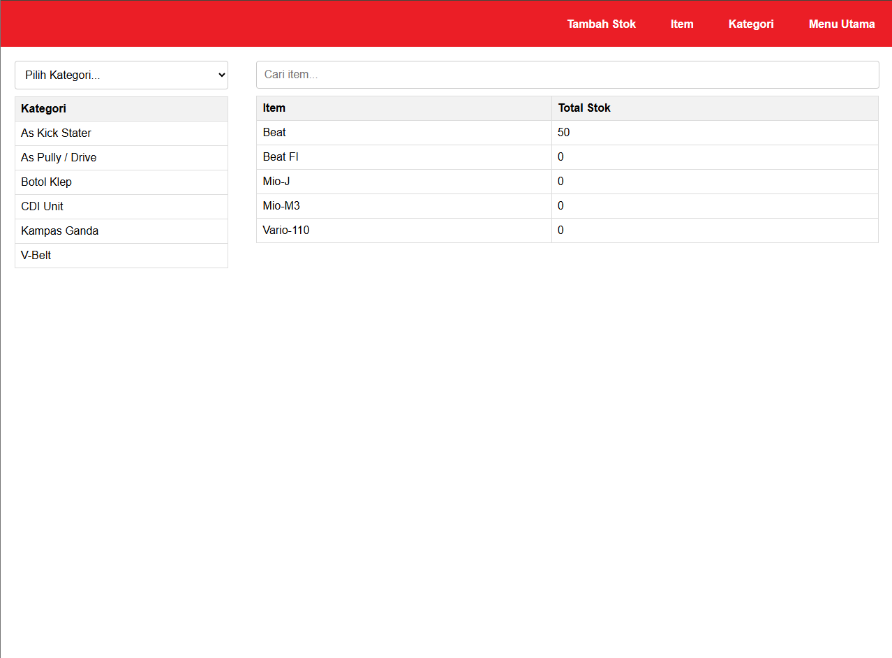
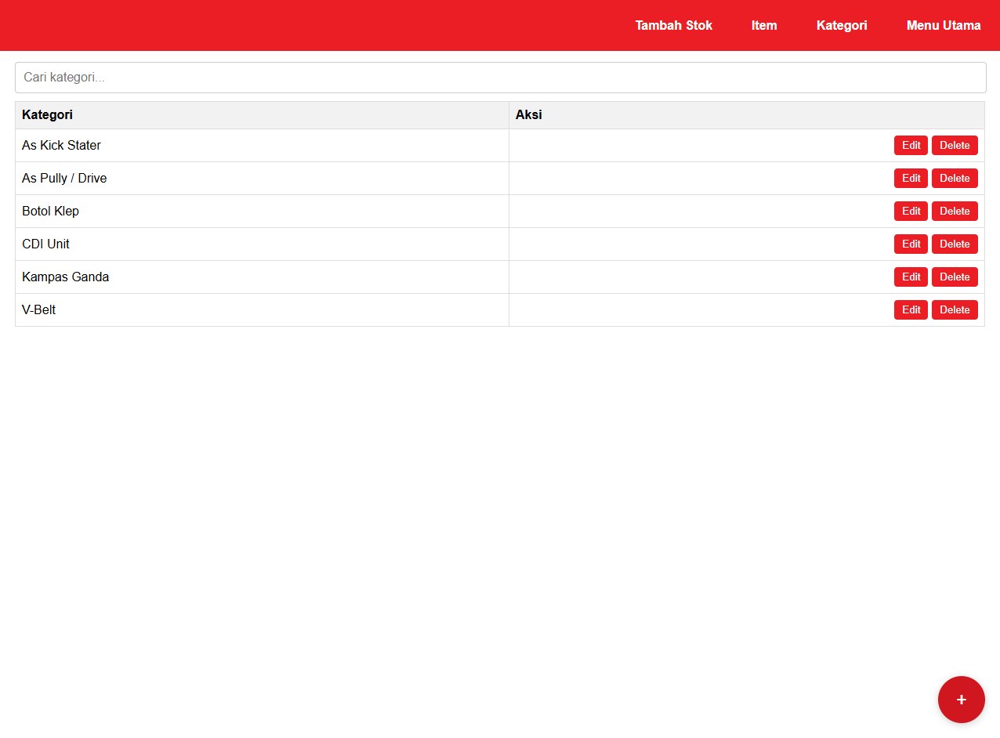
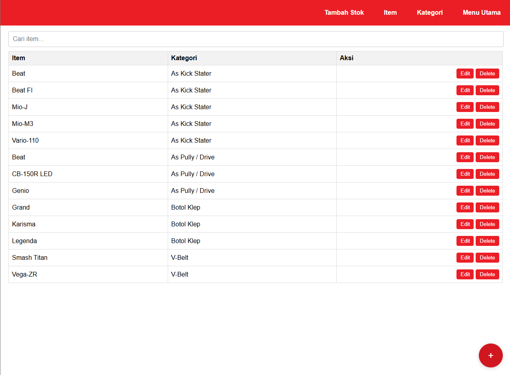
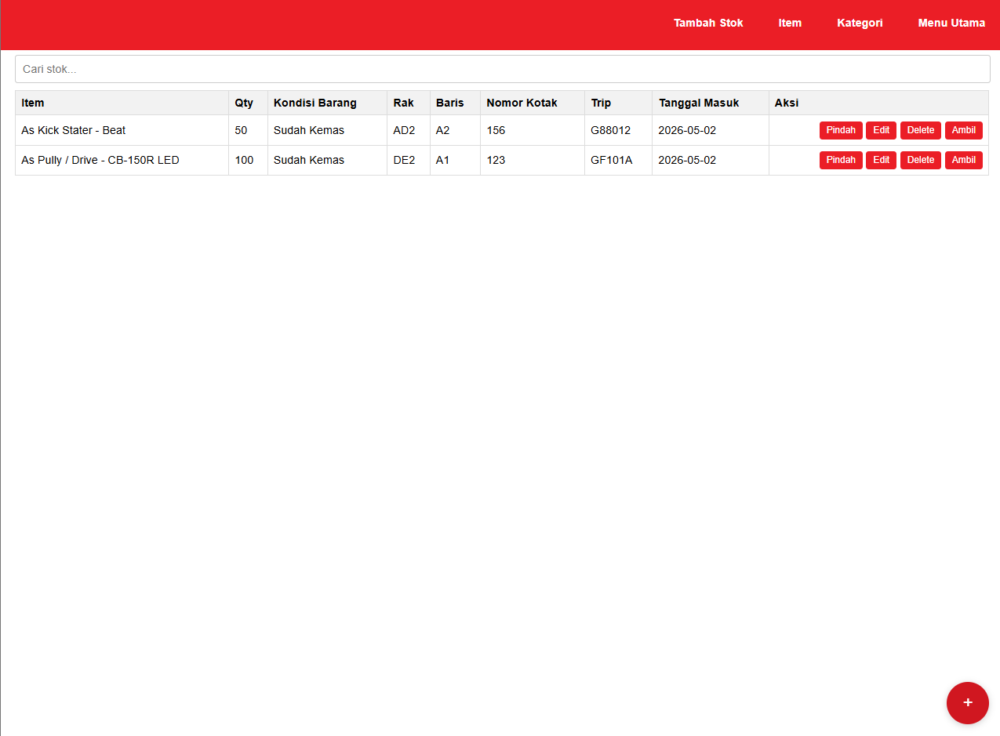

# 🔥 SmartStock Manager (Firebase Edition)

  
  
  
  

## 📝 Overview
This is a **Full-Stack Inventory Management System** built to handle high-velocity warehouse operations. Moving beyond static prototyping, this version leverages **Firebase Realtime Database** to provide instantaneous data synchronization across all connected clients.

The system was engineered to solve high-volume stock tracking challenges, providing a robust interface for managing thousands of motorcycle spare parts with sub-second latency and precise inventory accuracy.

---

## 🛠️ Technical Stack
*   **Frontend:** Vanilla JavaScript (ES6+), HTML5, CSS3.
*   **Database (BaaS):** Firebase Realtime Database for live persistence.
*   **Architecture:** Modular ES6 Scripting for maintainable and scalable code logic.
*   **Deployment:** Optimized for rapid cloud integration.

---

## 🚀 Key Features

*   **⚡ Live CRUD Operations:** Fully reactive Create, Read, Update, and Delete modules for Items, Categories, and Stock levels.
*   **📍 Precision Location Tracking:** Detailed inventory mapping down to specific **Racks (Rak)**, **Rows (Baris)**, and **Box Numbers (Nomor Kotak)**.
*   **🔄 Operational Workflows:** Integrated business logic for **"Pindah"** (Relocation) and **"Ambil"** (Picking), mirroring real-world warehouse movements.
*   **🔍 Dynamic Data Filtering:** Real-time search indexing and category filtering to minimize cognitive load during peak operational hours.

---

## 📈 Engineering Roadmap
This repository represents the **"Live Data Synchronization"** milestone in the system's evolution:
1.  **Inventory Concept:** UI/UX research and static prototyping.
2.  **SmartStock Manager (Current):** Cloud integration and full-stack logic implementation.
3.  **Desk ERP Ecosystem:** Migration to React/Next.js and Supabase for enterprise-scale requirements.

---

## 📸 System Preview

  <table border="0">
    <tr>
      <td align="center"> <b>Real-time Management Dashboard</b></td>
      <td align="center"> <b>Dynamic Category Management</b></td>
    </tr>
    <tr>
      <td align="center"> <b>Comprehensive Product List</b></td>
      <td align="center"> <b>Live Stock Monitoring</b></td>
    </tr>
  </table>

---

## ⚠️ Security & Local Setup
> [!IMPORTANT]
> **Industrial Best Practices:** To maintain security, sensitive API configurations have been excluded from this repository.
> 
> **To run this project locally:**
> 1. Rename `firebase-config.example.js` to `firebase-config.js`.
> 2. Insert your own Firebase project credentials.
> 3. Serve the directory using a local server (e.g., VS Code Live Server).
